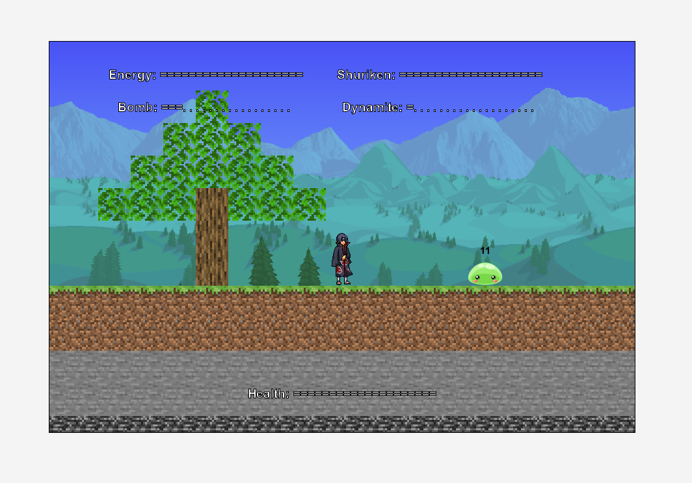

# Overworld

A Greenfoot game combining the elements of Minecraft, Terraria, 死神vs火影.

## Purpose of project

Greenfoot final project for grade 11 Computer Science.

## Creation date

v1.0.0

2022-01-27

## How to start this project

**Option 1**

open "project.greenfoot" with Greenfoot

**Option 2**

In Greenfoot menu, choose `Scenario`, `Open`

select project root directory.

## Authors

Ximing Hu

## Game premise

You can control the character to move and attack.

Avoid slimes and not to die. (It's hard to die)

## Sources used

Pictures and sounds

- [Minecraft Wiki](https://minecraft.fandom.com/wiki/Minecraft_Wiki)

- [Terraria Wiki](https://terraria.fandom.com/wiki/Terraria_Wiki)

- Terraria Official Soundtrack

No tutorials used.

## User instructions

Click "Start Game" on start screen to start.

(I just wanted to add a scolling background)

Notes:

Please turn on the sound.

The lag is significant when the program starts for the first few times. Please reset several times to improve.

### Keymaps

This section introduces the default key bindings. Key bindings can be customized in `Itachi.java`.

**Movement**

`a`: move to left

`d`: move to right

`k`: jump

**Attack**

`u`: shoot shuriken

`i`: shoot fireball

`s`+`u`: throw bomb

`s`+`i`: throw dynamite

You can jump for at most 2 times before landing.

You can walk on blocks.

Mouse clicks are not necessary during the game.

### Health and attack

When you contact with a slime, your health value will decrease.

Your health value percentage are shown at the bottom of the screen.

When you attack a slime, its health value will decrease.

Their health values are shown above each of them.

When you kill a green slime, it will drop something that you can collect.

Collected items are shown through the data bar on the top of the screen.

You can use the collected items by pressing assigned keys.

When you kill a pink slime, it will heal you and grow a tree of random size.

You can take damage when you are attacked by an enemy, dropped out of the world, or being hurt by an explosive.

When your health reaches 0, the game ends.

### Slime generation

New slimes are added to the world constantly unless there are 3 slimes in the world at the same time.

Slime generation speed will reduce as the number of enemies in the world increase.

### Item details

**Energy**

This value automatically increases.

When you shoot a fireball, the Energy will be set to 0.

Your fireball will be larger if the Energy value is larger.

You can quickly shoot many small fireballs, or wait for the Energy to increase and shoot a large fireball.

The fireball will destroy organic blocks(logs and leaves) and damage enemies.

There will be slight deviations when you shoot a fireball.

**Shuriken**

Shurikens have an initial velocity parallel to the ground, and they will drop to the ground due to gravity. However, they will still fly after they touch the ground (intended). They will disappear when they hit a wall or an enemy.

**Bomb**

This explosive will destroy blocks in a small range, hurt living things (including the player) and explode.

The bomb's initial vertical velocity equals to the players current vertical velocity.

It will stop moving when touches an enemy or a wall.

**Dynamite**

Same as the Bomb, but it has a larger explosion range.

**Drops**

These are the small items which a green slime will drop upon its death. You can pick them up, and the corresponding items will increase and show up on the data bar.

## Tiers met

**Tier 1**

- Main actor Itachi who can move in various directions. Lives displayed in the world.

- "Bad guy" actor slime, will jump toward the main character. It should be avoided.

- Dropped objects like explosives and projectiles can be collected and used later. Their numbers are recorded and displayed.

- Different sounds are played when destroyed an enemy or died (health is less than 0). Game stops when died.

**Tier 2**

- Shooting in one or more directions
  
  - Shoot fireball in different directions.
  
  - Explosives are thrown with vertical speed of the main character’s vertical speed.

- Gravity on most objects.
  
  - Main character
  
  - Slimes
  
  - Drops
  
  - Projectiles
  
  - Explosives

- Scrolling backgrounds at start screen.

- Explosions caused by explosives.

- Power ups and/or bullet reloads and/or drop off points for collected items, etc.
  
  - Energy automatically reloads.
  
  - Pick up projectiles and explosives dropped by green slimes.

- Keep track of items and display on the screen.
  
  - Energy
  
  - Shuriken
  
  - Bomb
  
  - Dynamite
  
  - Health

**Tier 3**

- Constructors that take parameters.
  
  - The Explosives class
    
    - radius: indicate the size of explosion
    
    - damage: indicate the amount of damage done on living things when explodes.
    
    - timeToExplode: number of acts to wait to explode
  
  - The Block class
    
    - image: indicate the image to use
    
    - breakable: indicate whether it can be destroyed by an explosive
    
    - organic: indicate whether it can be destroyed by fire.
  
  - The UncomplicatedAnimationHandler class
    
    - actor: indicate the actor it associates with
    
    - interval: indicate the number of acts to change to the next image index
    
    - another: copy constructor, indicates the instance to copy
  
  - There are many, these are just examples.

- Using and making accessors and mutators
  
  - The MyWorld class
    
    - `getPlayer`
    
    - `getGravity`
  
  - The GravityBound class
    
    - `getVSpeed`, `setVSpeed`
  
  - The Block class
    
    - `getBreakable`
    
    - `getOrganic`
    
    - `getSideLen`
  
  - The LivingThings class
    
    - `setInvulnerableTime`
    
    - `getHealth`, `setHealth`
  
  - etc.

- Changing the transparency of an image
  
  - Fireballs become increasingly transparent after being fired.

- Animations using arrays.
  
  - Animations are processed by `UncomplicatedAnimationHandler`
  
  - Main character standing and moving left and right. (4 arrays)
  
  - Slime alive and dead. (2 arrays)
  
  - Fireball (1 array)
  
  - etc.

- Collisions
  
  - `getObjectsInRange` (explosion)
  
  - `getIntersectingObjects` (damage)
  
  - `getObjectsAtOffset` (isLanding)
  
  - etc.

## Screenshots

## Known issues

- The user can pass through blocks from side.

- Slime sometimes slide on the ground.